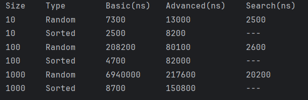

# Assignment 3: Sorting and Searching Algorithm Analysis System

## A. Project Overview
This project is an experimental analysis system designed to implement, measure, and compare the performance of three fundamental algorithms. By testing these algorithms across different array sizes and data structures, this project demonstrates the practical application of Big-O notation and execution time analysis in Java.

**Selected Algorithms:**
* **Basic Sort:** Bubble Sort
* **Advanced Sort:** Merge Sort
* **Searching:** Linear Search

---

## B. Algorithm Descriptions

### 1. Bubble Sort (Basic)
* **How it works:** It repeatedly steps through the list, compares adjacent elements, and swaps them if they are in the wrong order. This process repeats until the largest elements "bubble" up to their correct positions at the end of the array. Sorting stops when no swaps have been executed
* **Time Complexity:** $O(n^2)$
* **Best case:** $O(n)$

### 2. Merge Sort (Advanced)
* **How it works:** A divide-and-conquer algorithm that recursively splits the array into two halves, sorts them, and then merges the sorted halves back together using a temporary array.
* **Time Complexity:** $O(n \log n)$
* **Best case:** $O(n \log n)$

### 3. Linear Search (Searching)
* **How it works:** It starts at the beginning of the array and checks every single element sequentially until the target value is found or the end of the array is reached.
* **Time Complexity:** $O(n)$
* **Best case:** $O(1)$ (if target is the first element)

---

## C. Experimental Results

| Array Size | Input Type | Bubble Sort (ns) | Merge Sort (ns) | Linear Search (ns) |
|:-----------|:-----------|:-----------------|:----------------|:-------------------|
| 10         | Random     | 7,300            | 13,000          | 2,500              |
| 100        | Random     | 208,200          | 80,100          | 2,600              |
| 1000       | Random     | 6,940,000        | 217,600         | 20,200             |
| 10         | Sorted     | 2,500            | 8,200           | N/A                |
| 100        | Sorted     | 4,700            | 82,000          | N/A                |
| 1000       | Sorted     | 8,700            | 150,800         | N/A                |

---

## D. Performance Analysis

1.  **Which sorting algorithm performed faster? Why?**
    Merge Sort was significantly faster, especially as the array size increased. While Bubble Sort's time grew quadratically, Merge Sort's divide-and-conquer approach allowed it to handle 1,000 elements with ease.

2.  **How does performance change with input size?**
    For Bubble Sort, doubling the input size roughly quadruples the execution time ($O(n^2)$). For Merge Sort and Linear Search, the increase is much more manageable and linear in appearance at these scales.

3.  **How does sorted vs unsorted data affect performance?**
    Bubble Sort is faster on sorted data because fewer swaps occur, as it performs $O(n)$ comparisons in this implementation. Merge Sort remains consistent regardless of the data's initial order.

4.  **Do the results match the expected Big-O complexity?**
    Yes. The results clearly show the $O(n^2)$ curve of Bubble Sort versus the much flatter $O(n \log n)$ curve of Merge Sort.

5.  **Which searching algorithm is more efficient? Why?**
    In this experiment, Linear Search is $O(n)$. While efficient for small arrays, it would be much slower than Binary Search ($O(\log n)$) if the dataset were significantly larger (e.g., 1,000,000 elements).

6.  **Why does Binary Search require a sorted array?**
    Binary Search works by jumping to the middle and eliminating half the data. This logic only works if the data is ordered; otherwise, you cannot know which side the target is on.

---

## E. Screenshots

*Figure 1: Console output showing execution times for different array sizes.*

---

## F. Reflection
Through this assignment, I learned that theoretical complexity (Big-O) translates very clearly into real-world performance. I observed how an $O(n^2)$ algorithm like Bubble Sort becomes impractical very quickly as data grows.